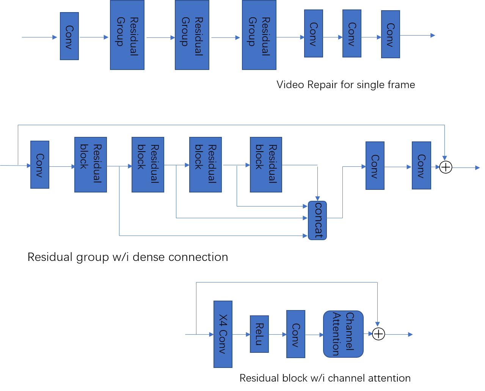

# Video Repair for 马栏山杯 contest
The code in this repo is used to take part in the video repair contest, whose task is to remove artifacts in video caused by JPEG compression. You can click <a href="" target="_blank">this link</a> to see more details.

### Installation
---
The code is tested under Python 3.5.2, Tensorflow 1.8.0, CUDA 10 and cuDNN 7.1.4.

Run `make` to compile deform_conv ops.

### Model
---
The majority of code is modified from EDVR. What I do is to find a more appropriate reconstruction model for video repair. The model is shown as follows.

### Train
---
Firstly, you can have a look at scripts under **tools** folder to prepare data used to train.

Secondly, configure `params.py` to make sure the code will work as you desire.

Finally, run `python train.py` to train your own model.

### Acknowledgement
---
**deform_conv ops** is copied from <a href="https://github.com/Zardinality/TF-deformable-conv" target="_blank">TF-deformable-conv</a>.